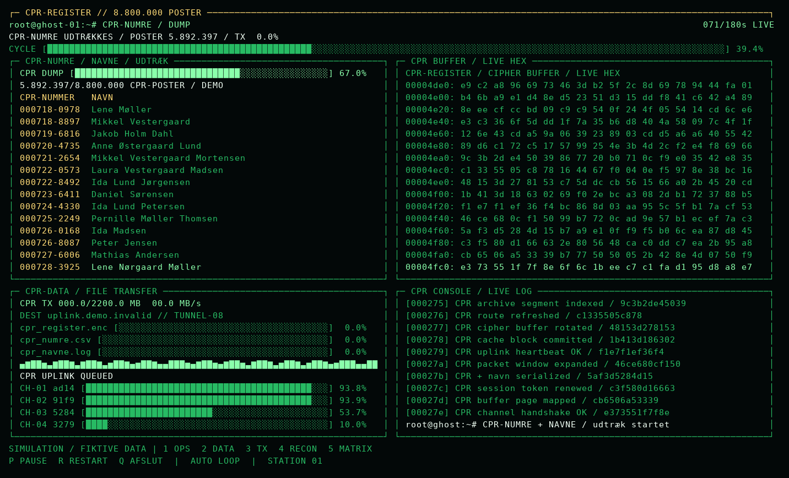
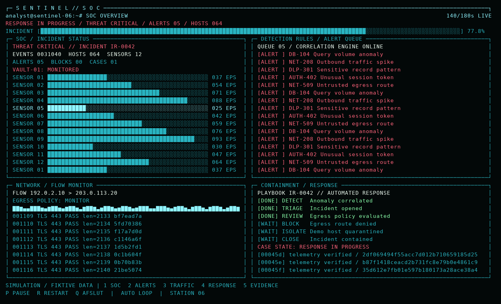
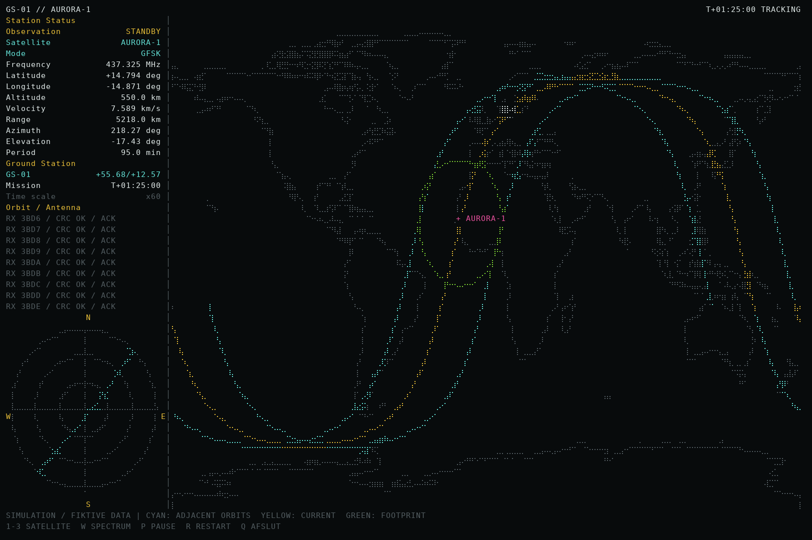

# Open House Terminal Shows

Tre **separate terminalprogrammer** til en cybersikkerhedsopstilling:

- **Red team — `red_team.py`:** Et grønt hacker-show med root-console,
  et CPR-register, navne, CPR-demoværdier, hex-buffers og filoverførsler.
- **Blue team — `blue_team.py`:** En cyanfarvet SOC-terminal med overvågning,
  røde alarmer, trafik, bevismateriale og hændelseshåndtering.
- **Satellitstation — `satellite.py`:** Et stort verdenskort med banespor,
  dækningsområde, polardiagram og et valgfrit radiospektrum.

Hvert program har sit eget simulerede forløb. Der er ingen menu, som skifter
mellem programmerne. Red- og blue-team-panelerne fylder hele terminalens højde og
bredde: én kolonne på smalle vinduer, to på almindelige vinduer og tre på brede
skærme. Logs og buffers fortsætter med at bevæge sig mellem faserne.

Begge programmer kræver kun **Python 3.8 eller nyere**, ingen ekstra pakker.
Efter hentning kan de køre helt offline.

## Hent eller opdater på Kali Linux

```bash
git clone https://github.com/fisterloegsovs/openHouseDemo.git
cd openHouseDemo
```

Har du allerede projektet, kører du `git pull --ff-only` i projektmappen.
Brug terminalens fuldskærmstilstand (ofte F11) og en skriftstørrelse, der kan
læses på afstand. Programmerne aflæser terminalens faktiske størrelse og
tilpasser sig automatisk ved ændringer. En enkelt kolonne i højre kant er
reserveret for at undgå, at terminalen scroller.

## Red team



```bash
python3 red_team.py
```

Vælg forskellige visninger på forskellige maskiner:

| PC | Kommando | Visning |
| --- | --- | --- |
| 1 | `python3 red_team.py --mode overview --station 1` | Root-session, buffers og overførsler |
| 2 | `python3 red_team.py --mode extract --station 2` | CPR-register med demoværdier og navne |
| 3 | `python3 red_team.py --mode transfer --station 3` | Filer, progressbarer og pakkestrøm |
| 4 | `python3 red_team.py --mode recon --station 4` | Fiktive værter, porte og sessions |
| 5 | `python3 red_team.py --mode matrix --station 5` | Matrix-effekt over hele skærmen |

Målet er tydeligt mærket **CPR-REGISTER**, og udtræksvisningen har en gul,
fremhævet **CPR-NUMMER**-kolonne før navnene. Forløbet viser adgang til registret,
udtræk af **8.800.000 fiktive CPR-poster**, arkivering og en simuleret overførsel
på **2,2 GB** af `cpr_register.enc` og
`cpr_numre.csv`. Logs og statuslinjer følger det samme CPR-tema. Tælleren når
8.800.000 i hvert forløb. Kun de synlige poster genereres: CPR-demoværdierne
er forskellige gennem hele udtrækket, mens de 500 navne i `navne.json` genbruges.
Der oprettes ikke en fil med millioner af poster.
Udtræksvisningen er standard, når programmet startes uden `--mode`.
Der vises ingen SOC-respons i dette program.
`demo.py` fungerer stadig som en genvej til red-team-programmet.

## Blue team



```bash
python3 blue_team.py
```

| PC | Kommando | Visning |
| --- | --- | --- |
| 6 | `python3 blue_team.py --mode overview --station 6` | SOC-overblik og sensorer |
| 7 | `python3 blue_team.py --mode alerts --station 7` | Alarmkø og korrelation |
| 8 | `python3 blue_team.py --mode traffic --station 8` | Trafik, flows og policy |
| 9 | `python3 blue_team.py --mode response --station 9` | Triage, blokering og isolering |
| 10 | `python3 blue_team.py --mode evidence --station 10` | Fiktive hex-buffers og bevismateriale |

Blue-team-forløbet går fra normal overvågning til afvigelser, kritiske alarmer,
blokering og inddæmning. Det kræver ikke navnedatasættet. De to hold har
selvstændige historier; de udveksler ingen data og påvirker ikke hinanden.

## Satellitstation



```bash
python3 satellite.py
```

Visningen er inspireret af satellitmonitoren i referencen: en smal statuskolonne
og et stort kort med nedtonede kystlinjer. Cyan viser tilstødende banespor,
gul det aktuelle spor og grøn satellittens dækningsområde. Markøren viser
satellittens position; et polardiagram viser den fiktive antenneretning.

Tilføj radiospektrum og waterfall nederst på kortet:

```bash
python3 satellite.py --waterfall
```

- **1–3:** Vælg mellem AURORA-1, POLARIS-2 og VEGA-3.
- **W:** Vis eller skjul spectrum/waterfall.
- **P**, **R** og **Q:** Pause, genstart og afslut.

Satellitterne er opdigtede og bruger en tilnærmet, cirkulær bane. Banerne
fortsætter løbende, uden at programmet skal genstartes. Standardhastigheden er
60 gange virkelig tid; `--speed 30` gør bevægelsen langsommere. Sidebarens
position, azimut, elevation og signalstatus følger den simulerede bane.
Spektrum og waterfall er visuelle effekter, ikke målinger eller radiomodtagelse.

Jordstationens fiktive position er som standard ved København. Den kan ændres:

```bash
python3 satellite.py --latitude 55.68 --longitude 12.57 --station 3
```

Denne visning kræver mindst **70 × 24** terminalceller. Den bruger braille-tegn
til fine kortdetaljer; hvis din skrifttype viser firkanter, prøv en anden
terminalskrifttype eller `--ascii`. Kystlinjerne fra Natural Earth er med i
projektet, så internet og en SatNOGS-station ikke er nødvendige. Kilde og
public-domain-vilkår står i [assets/COASTLINES.md](assets/COASTLINES.md).

## Betjening og gentagelse for red og blue team

- **1–5:** Skift visning inden for det program, du har startet.
- **P** eller **mellemrum:** Pause eller fortsæt.
- **R:** Start forløbet forfra på denne maskine.
- **Q** eller **Ctrl+C:** Afslut og gendan terminalen.

Forløbene gentager automatisk hver 180. sekund. Tilføj eksempelvis
`--duration 300` for fem minutter. Programmerne bruger computerens ur, så
flere maskiner inden for samme hold kan vise samme fase uden netværksforbindelse.
Det kræver ens varighed og korrekt indstillede ure. Pause og lokal genstart
ændrer denne maskines fase; genstart programmet for at følge fælles tid igen.

Terminalen skal være mindst 62 kolonner bred og 22 linjer høj. 100 × 32 eller
større giver plads til flere paneler. Ved 150 kolonner får du seks paneler.

En ekstra maskine kan vise `btop` separat. Dets tal er maskinens faktiske
aktivitet; grafer og tal i disse shows er simulerede.

## Windows

Installér Python 3.8 eller nyere, kopiér/hent hele projektmappen, og åbn den i
Windows Terminal eller PowerShell:

```powershell
py -3 red_team.py --mode extract --station 2
```

På en anden maskine:

```powershell
py -3 blue_team.py --mode overview --station 6
```

Satellitvisningen startes med `py -3 satellite.py`.

Argumenterne og tasterne er de samme. Tilføj `--ascii`, hvis bloktegn eller
rammer vises forkert, eller `--no-color` for at slå farver fra. Windows er
understøttet i koden, men endnu ikke afprøvet på en Windows-PC.

## Demo-data

Alt er visuelle effekter: Der sendes ingen data, køres ingen eksterne kommandoer,
scannes ingen værter og oprettes ingen arkiver. Værtsnavne bruger `.invalid`,
og IP-adresser er fra dokumentationsområder. Hex-data er genererede visuelle
bytes, ikke indhold fra netværkstrafik eller rigtig kryptering.

Red team læser `navne.json` lokalt uden at ændre filen. Navnene er kombineret
fra indbyggede lister og kan tilfældigvis matche rigtige personer. CPR-felterne
viser demoværdier som `000140-0001` i det velkendte seks-plus-fire-format.
Alle starter med fødselsdag **00**, som er ugyldig, så værdierne ikke kan være
rigtige CPR-numre. De er stabile gennem forløbet og genereres kun til visningen;
navnefilerne ændres ikke. Alle visninger er
mærket med `SIMULATION / FIKTIVE DATA` nederst.

## Kontrol og test

```bash
python3 -m unittest -v
python3 red_team.py --mode extract --frames 1 --no-color
python3 blue_team.py --mode alerts --frames 1 --no-color
python3 satellite.py --frames 1 --no-color
```

`--frames 1` skriver ét skærmbillede uden at kræve en interaktiv terminal.
Kør ét helt, forkortet forløb i en terminal med:

```bash
python3 red_team.py --duration 20 --once
```

Den samme kontrol kan udføres med `blue_team.py` og `satellite.py`.

## Generér nye navne

```bash
python3 generer.py
```

Kommandoen erstatter `navne.csv` og `navne.json` ved siden af scriptet.
Et fast seed giver samme 500 unikke navnekombinationer ved hver kørsel.
CSV-filen er semikolonsepareret UTF-8 med BOM, JSON-filen er UTF-8.
Hver post indeholder `demo_id`, `fornavn`, `mellemnavn`, `efternavn` og
`fuldt_navn`. Mellemnavnet kan være tomt.
